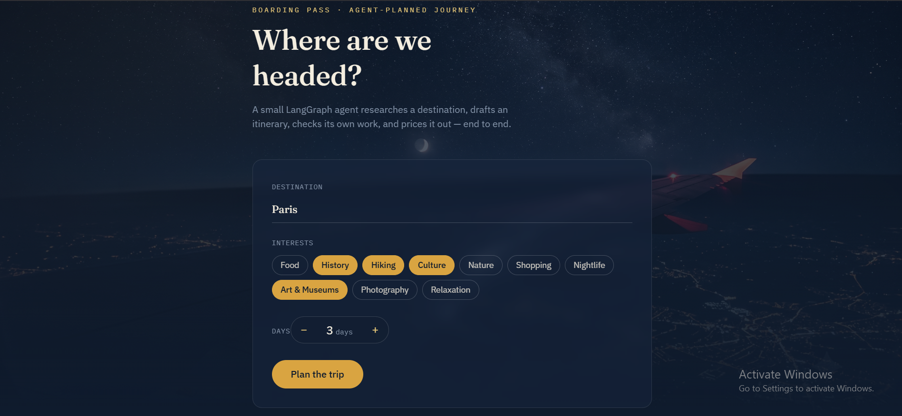
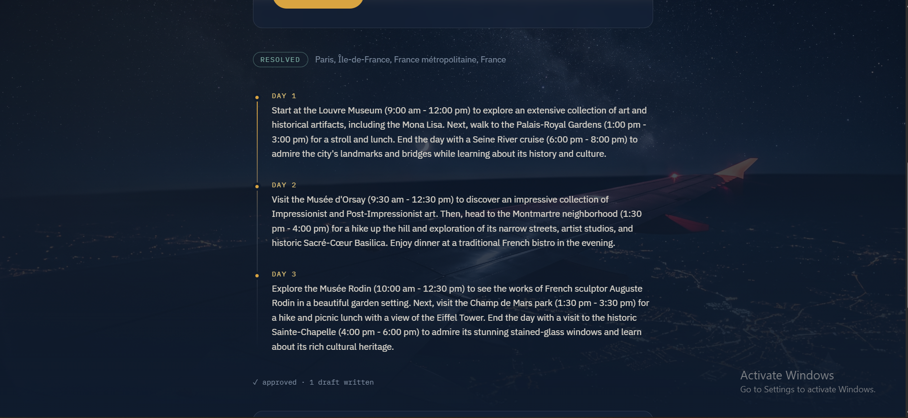
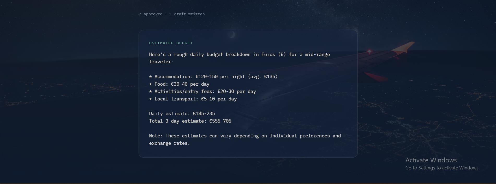

# LangGraph Trip Planner

**Live demo:** https://lang-graph-trip-planner.vercel.app/






A small full-stack agent: it resolves a destination, researches it, drafts
a day-by-day itinerary, critiques its own draft (looping back to revise if
needed), and estimates a budget — wrapped in a FastAPI backend and a
React + TypeScript + Tailwind frontend.

Built as a hands-on way to learn LangGraph's core ideas — **state, nodes,
edges, and conditional edges (loops)** — before applying the same patterns
to a larger project.

## How the agent works

```
resolve --> research --> draft --> critique --+
                            ^                 |
                            |   (not approved, revisions left)
                            +------ revise ---+
                                              |
                                              | (approved, or out of revisions)
                                              v
                                           budget --> END
```

| Node | Type | Job |
|---|---|---|
| `resolve` | tool (no LLM) | Turns whatever you typed into an unambiguous place name via free geocoding (OpenStreetMap Nominatim) |
| `research` | tool (no LLM) | Searches the web for top attractions at the resolved location |
| `draft` | agent | Writes (or revises) the itinerary using the research |
| `critique` | agent | Reviews the draft; approves it or sends it back with feedback |
| `budget` | agent | Estimates a rough daily cost breakdown, once approved |

## Project structure

```
├── Backend/
│   ├── state.py        shared state schema
│   ├── nodes.py         the 5 node functions above
│   ├── graph.py           wires the nodes into the graph + the revision loop
│   ├── api.py               FastAPI wrapper exposing POST /api/plan
│   ├── main.py               CLI version (no server needed)
│   └── requirements.txt
└── Frontend/
    ├── src/App.tsx      the whole UI (form + results)
    └── src/index.css     design tokens, background, animations
```

## Running it locally

**Backend** (from `Backend/`):
```bash
python -m venv venv
source venv/bin/activate        # Windows: venv\Scripts\activate
pip install -r requirements.txt
cp .env.example .env             # then add your real GROQ_API_KEY
uvicorn api:app --reload --port 8000
```
✅ Checkpoint: http://localhost:8000/api/health → `{"status":"ok"}`

**Frontend** (from `Frontend/`, in a second terminal):
```bash
npm install
npm run dev
```
✅ Checkpoint: opens on http://localhost:5173

Or run the graph standalone with no server at all:
```bash
python main.py
```

## Deploying it

- **Backend →** Render (free tier): root directory `Backend`, build command
  `pip install -r requirements.txt`, start command
  `uvicorn api:app --host 0.0.0.0 --port $PORT`, with `GROQ_API_KEY` set as
  an environment variable.
- **Frontend →** Vercel (free tier): root directory `Frontend`, with
  `VITE_API_URL` set to your Render backend's URL.

## Things to try next

- Set `MAX_REVISIONS = 0` in `nodes.py` and rerun — the loop gets skipped
  entirely since there's no revision budget left.
- Add a `print(state)` at the top of any node to watch the state grow as
  it moves through the graph.
- Add a 6th node — e.g. a packing-list generator that runs alongside
  `budget` — for practice extending a graph rather than building one from
  scratch.

## Before pushing to GitHub

Add a `.gitignore` at the root with:
```
venv/
node_modules/
.env
__pycache__/
dist/
```
This keeps your API key, virtual environment, and build output out of the repo.